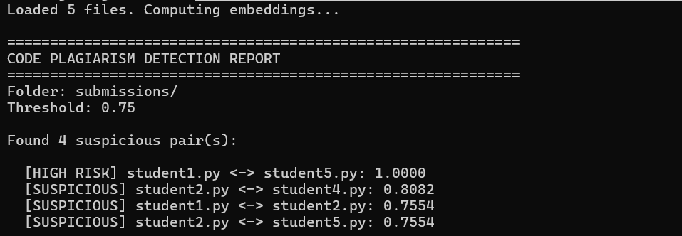

# Code Plagiarism Detector

A prototype tool that detects similar code submissions using semantic
embeddings. Aimed at catching paraphrased plagiarism where students
rename variables or change formatting.

## What It Does

Given a folder of code files, the tool computes a similarity score
between every pair and flags pairs above a threshold as potentially
copied.

It uses a pretrained code embedding model to convert each file into
a vector, then compares vectors using cosine similarity.

## Why Semantic Embeddings

Simple text comparison (like diff or hash-based checks) misses cases
where a student renames variables or reformats code. Semantic
embeddings capture what the code does, not just how it looks — so
paraphrased copies still score high similarity.

This is not a novel approach. It is a standard application of
pretrained code embedding models to the plagiarism detection problem.

## Tech Stack

- Python 3.10+
- sentence-transformers (Hugging Face)
- scikit-learn
- Pretrained model: flax-sentence-embeddings/st-codesearch-distilroberta-base

## Installation

\`\`\`
pip install sentence-transformers scikit-learn torch
\`\`\`

## Usage

\`\`\`
python detect.py submissions/
\`\`\`

Reads all .py, .c, .cpp, and .java files from the folder, computes
pairwise similarity, and prints pairs above the threshold (default 0.75).

## Sample Output

Tested on 5 files:
- Two exact copies of a prime-check function
- One version with renamed variables
- One version with different code style but same logic
- One completely different problem (factorial)

The tool correctly flagged the copies and paraphrased versions, and
did not flag the unrelated factorial file.

## Current Limitations

- Only tested on small Python files (< 30 lines each)
- Threshold is a fixed heuristic, not learned
- No handling of very large files (may exceed model's token limit)
- Does not detect AI-generated code
- No user interface — CLI only
- Not tested against real academic datasets

## Planned Next Steps

- Add a Streamlit interface for uploading files
- Test on a larger and more realistic dataset
- Experiment with different similarity thresholds
- Add per-line highlighting of suspicious sections

## Author

A Ragavendran | 3rd year B.Tech IT, SASTRA University